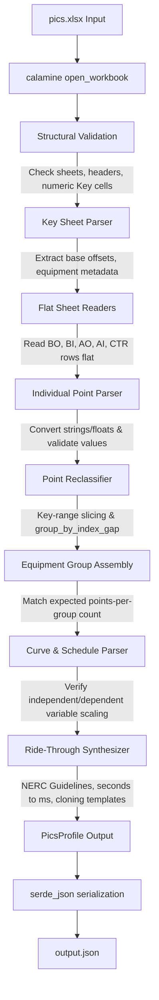

# PICS Validator: Architecture & Design Document

This document describes the design, data transformations, and architectural decisions of the **PICS Validator**, a Rust-based tool and library that validates and transforms IEEE Std 1815.2-2025 companion data point tables (PICS) in spreadsheet format into structured, validated JSON profiles.

---

## 1. Architectural Overview

The `pics-validator` functions as a pipeline. It converts a physical, flat spreadsheet (or a raw JSON document) into a strongly typed, hierarchical representation of a DNP3 PICS profile.



---

## 2. Ingestion Pipeline & Step-by-Step Transformations

### Step 2.1: Workbook Loading & Structural Validation
* **Source Files**: [`src/loader.rs`](src/loader.rs), [`src/validators.rs`](src/validators.rs)
* **Input**: An XLSX spreadsheet at a path (e.g. `pics.xlsx`).
* **Transformation / Logic**:
  1. Opens the file using `calamine::open_workbook` which reads the workbook.
  2. Validates that all six required sheets exist: `Key`, `BO`, `BI`, `AO`, `AI`, and `CTR`.
  3. Checks the column layout of the data sheets. Each data sheet must have at least a minimum number of columns (as defined in `Sheet::expected_col_count` in [`src/schema.rs`](src/schema.rs)):
     * **BO**: $\ge 10$ columns
     * **BI**: $\ge 11$ columns
     * **AO**: $\ge 15$ columns
     * **AI**: $\ge 17$ columns
     * **CTR**: $\ge 10$ columns
  4. Matches specific column headers against a static checklist (`HeaderSpec`). Header text comparison is normalized to handle carriage return XML artifacts (`_x000D_`), collapse whitespace, and ignore case:
     ```rust
     fn normalize_header(s: &str) -> String {
         s.replace("_x000D_", "")
             .split_whitespace()
             .collect::<Vec<_>>()
             .join(" ")
             .to_lowercase()
     }
     ```
  5. Scans predetermined cells in the `Key` sheet that must be numeric (defined in `schema::key_numeric_positions()`) to ensure structural validity before parsing. If they contain non-numeric data, loading aborts immediately with a hard error.

> [!IMPORTANT]
> **Excel Cached Formulas**: Calamine reads cells without running an Excel calculation engine. If the spreadsheet uses formulas to generate indices or counts (e.g. `=SUM(C4:C8)`), the spreadsheet **must be opened and saved in MS Excel** before validation to populate cached values.

---

### Step 2.2: Key Sheet Parsing
* **Source Files**: [`src/loader.rs`](src/loader.rs), [`src/schema.rs`](src/schema.rs)
* **Input**: The `Key` worksheet cell matrix (`Range<Data>`).
* **Transformation / Logic**:
  The loader parses the table in the `Key` sheet to determine where the starting indices and instance counts lie for base point sections, schedules, curves, and equipment groups:
  * **Numeric extraction**: Cell values are read from static 0-based coordinate positions. Any floats/strings representing integers are parsed/rounded into `u16`. Empty cells or values like `"-"` or `"x"` default to `0`.
  * **Extracted Schema boundaries**:
    * **Configuration/Control**: Starts at dynamic BO, BI, AO, AI, and CTR indices (Row index 4).
    * **Functions**: Slices starting indices (Row index 5).
    * **Curves**: Starting AI index (Row index 6).
    * **System Meter**: Slices starting indices (Row index 7).
    * **Extensions**: Slices starting indices (Row index 8).
    * **Schedules BC**: Starts at a dynamic index, defaulting to `2000` (Row index 12).
    * **Schedules**: Starts at a dynamic index, defaulting to `3000` (Row index 14).
    * **Meters**: Starts at index in Column 2 (default `5000`) with instance count in Column 9 (Row index 19). Points-per-equipment count is extracted from row 20.
    * **DER Units**: Starts at index in Column 2 (default `10000`) with instance count in Column 9 (Row index 22). Points-per-equipment count is extracted from row 23.
    * **Inverters**: Starts at index in Column 2 (default `15000`) with instance count in Column 9 (Row index 25). Points-per-equipment count is extracted from row 26.
    * **Batteries**: Starts at index in Column 2 (default `20000`) with instance count in Column 9 (Row index 28). Points-per-equipment count is extracted from row 29.
    * **Experimental, Vendor, Auto-Discovery**: Boundary markers used to partition flat points.

---

### Step 2.3: Flat Sheet Loading
* **Source Files**: [`src/loader.rs`](src/loader.rs)
* **Input**: The worksheets `BO`, `BI`, `AO`, `AI`, and `CTR`.
* **Transformation / Logic**:
  The parser loops through each row starting at index `2` (`DATA_ROW_START`) to read flat points.
  
  ```
  XLSX Row representation:
  ┌─────────────────┬───────────────────┬──────────────┬──────────────┬─────────┐
  │ DNP3 Point idx  │ Name/Description  │ Event Class  │ ...          │ EUT Cap │
  ├─────────────────┼───────────────────┼──────────────┼──────────────┼─────────┤
  │ "BI 5000"       │ "Active Power..." │ "1"          │ ...          │ "M"     │
  └─────────────────┴───────────────────┴──────────────┴──────────────┴─────────┘
  ```

  1. **Row Identification**: If a row does not start with the sheet prefix (e.g. `"BI"` or `"BO"`) in column `0`, it is ignored. Row sections that resemble standard section headers (having an empty column `0` but a non-empty name in column `1`) are skipped.
  2. **Index Suffix Parsing**: The point index string (e.g., `"BI 5000"` or `"BI5000"`) is parsed by stripping non-digits and converting the rest into a `u16`:
     ```rust
     fn parse_point_index_u16(s: &str) -> Result<u16> {
         let digits = s.trim_start_matches(|c: char| !c.is_ascii_digit());
         digits.parse::<u16>()
     }
     ```
  3. **Mandatory Field Evaluation**: Columns containing `"M"` evaluate to `true` (mandatory). If the field starts with `"C:"` or `"C "`, it represents a conditional mandatory requirement, which defaults to `false` in the parser stub:
     ```rust
     fn parse_mandatory(range: &Range<Data>, row: u32, col: u32) -> bool {
         match cell_str(range, row, col).as_deref() {
             Some("M") => true,
             Some(s) if s.starts_with("C:") || s.starts_with("C ") => evaluate_conditional_mandatory(s),
             _ => false,
         }
     }
     ```
  4. **Data Type Coercion**: 
     * **Strings**: Trimmed. Empty strings map to `None`.
     * **Event Class**: Integers `1`, `2`, `3` or equivalent strings map to `EventClass::Class1`, `EventClass::Class2`, or `EventClass::Class3`. Everything else maps to `EventClass::None`.
     * **Numeric values (Minimum, Maximum, Multiplier, Offset, Value)**:
       Parsed via `cell_float_required` and `cell_i32_required`. If a cell is missing or contains non-numeric text (e.g., `"Varies. May not be r/w"`), it registers a `LoadError` warning in the output list and defaults to `0` (or `i32::MIN`/`i32::MAX`/`1.0` as appropriate) so the profile still loads.

> [!TIP]
> **Coercion Decisions**:
> * Multipliers are checked; if they are resolved to `0.0`, it is treated as an error, a warning is recorded, and the multiplier is coerced to `1.0` to prevent division-by-zero errors in downstream scaling.
> * Rounded integer checking: Excel floats are rounded (`f64::round()`) and parsed to `i32`. If they overflow the bounds of an `i32`, a warning is logged, and a default fallback is used.

---

### Step 2.4: Point Reclassification & Slicing
* **Source Files**: [`src/loader.rs`](src/loader.rs)
* **Input**: The flat lists of points parsed in Step 2.3.
* **Transformation / Logic**:
  Using the starting boundaries loaded in Step 2.2, points are partitioned.
  
  ```
  Point Index Distribution (BI Example):
  [0 ──────────────────────── 4999] [5000 ────────────── 9999] [10000 ────── 14999] [30000 ────── 65535]
             Base                           Meters                  DER Units          Experimental (Base)
  ```

  For each point in the flat list, its index determines its bin:
  * If $\ge \text{Experimental Start}$ (usually 30000), it is placed in the **Base** list.
  * If $\ge \text{Battery Start}$ (usually 20000), it is placed in the **Battery** temporary bin.
  * If $\ge \text{Inverter Start}$ (usually 15000), it is placed in the **Inverter** temporary bin.
  * If $\ge \text{DER Start}$ (usually 10000), it is placed in the **DER** temporary bin.
  * If $\ge \text{Meter Start}$ (usually 5000), it is placed in the **Meter** temporary bin.
  * Otherwise, it is placed in the **Base** list.

---

### Step 2.5: Equipment Group Assembly (Gap Detection)
* **Source Files**: [`src/loader.rs`](src/loader.rs)
* **Input**: Flat lists of points assigned to equipment bins.
* **Transformation / Logic**:
  Within each equipment bin, multiple physical units (e.g. Inverter #1, Inverter #2) are packed side-by-side. The parser distinguishes them by grouping points separated by index gaps greater than 1:
  ```rust
  fn group_by_index_gap<P, F>(points: Vec<P>, get_index: F) -> Vec<Vec<P>>
  where
      F: Fn(&P) -> Option<i64>,
  ```
  
  For example, if `inverters_flat` contains points with indices:
  `[15000..15033]` and `[15035..15068]` (gap between 15033 and 15035), they are split into two groups.

  **Validation & Group Drops**:
  Each group must contain the exact number of points expected for that equipment category:
  | Category | BI Points | AO Points | AI Points |
  |---|---|---|---|
  | **Meter** | 13 | 12 | 37 |
  | **DER Unit** | 4 | N/A | 15 |
  | **Inverter** | 35 | 12 | 34 |
  | **Battery** | 54 | 4 | 28 |

  If a group contains an unexpected number of points, it indicates a misconfigured template or a missing point. The validator logs a `point_count` warning in the `errors` array and **discards the entire group**. If it matches, the points are mapped sequentially to the strongly typed fields of the corresponding struct (`BiMeter`, `BiInverter`, etc.).

---

### Step 2.6: Curve & Schedule Parsing
* **Source Files**: [`src/loader.rs`](src/loader.rs)
* **Input**: Flat lists of points assigned to Curve or Schedule index ranges.
* **Transformation / Logic**:
  * **AI Curves**: Points within `[curves_start, system_meter_start)` are grouped.
    * The first point is the Curve Edit Selector.
    * The next 4 points represent metadata: `curve_type`, `number_of_points`, `x_units`, and `y_units`.
    * Remaining points are read as alternating `(x, y)` coordinate value points.
  * **AI Schedules BC (2 items/step)**: Points within `[schedule_bc_start, schedule_start)` are grouped.
    * First 2 points are the Running Schedule Index and Schedule Edit Selector (which are moved to base points).
    * The next 10 points represent metadata: `identity`, `priority`, `schedule_type`, `start_date`, `start_time`, `repeat_interval`, `repeat_interval_units`, `validation_status`, `status`, and `number_of_points`.
    * Remaining points represent repeating pairs of `(time_offset, value)`.
  * **AI Schedules (4 items/step)**: Points within `[schedule_start, meter_start)` are grouped.
    * First point is the Schedule Edit Selector (moved to base points).
    * Next 11 points represent metadata: `identity`, `priority`, `start_date`, `start_time`, `stop_date`, `stop_time`, `repeat_interval`, `repeat_interval_units`, `validation_state`, `status`, and `number_of_points`.
    * Remaining points represent repeating quadruplets of `(time_offset, action_type, action_index, value)`.

---

### Step 2.7: Scaling Validation and Correction
* **Source Files**: [`src/loader.rs`](src/loader.rs), [`src/scale_curve.rs`](src/scale_curve.rs)
* **Transformation / Logic**:
  1. **Curve coordinate scaling**:
     Using the numeric value of `x_units` and `y_units`, the validator checks the active independent and dependent variable types against the standard scaling table:
     * Independent variables (`IndependentVariable::from_code`) use **Table 16** rules.
     * Dependent variables (`DependentVariable::from_code`) use **Table 17** rules.
     * The points in `x_values` and `y_values` are updated to match the mandatory standard `minimum`, `maximum`, and `multiplier` for that variable type.
     * If the parsed XLSX sheet deviates from these values, a post-assembly `LoadError` warning is appended.
  2. **Schedule value scaling**:
     If a schedule's `action_type` equals `1` (representing an Analog Output action), the schedule value coordinates must match the limits and scaling of the target `AO` point. The validator matches `action_index` to the corresponding `AoPoint` in the workbook, and overrides the schedule value's scaling (`minimum`, `maximum`, `multiplier`, `offset`) with the target `AO` point's metadata.

---

### Step 2.8: Ride-Through Profile Synthesis
* **Source Files**: [`src/loader.rs`](src/loader.rs)
* **Input**: The partially assembled `PicsProfile` and the XLSX filename.
* **Transformation / Logic**:
  If the input XLSX filename matches one of the preset profile templates (`full`, `mandatory_1815`, `mandatory_1547`, `minimal_1547`), the validator synthesizes standard ride-through profiles by cloning the workbook's curve/schedule structure and injecting coordinates derived from **NERC Reliability Guidelines (2023)**:
  
  * **Voltage Tripping Requirements (Category 1, 2, 3)**:
    * High Voltage Ride-Through: 4 points: (160 ms, 120%), (2000 ms, 120%), (2000 ms, 110%), (100000 ms, 110%).
    * Low Voltage Ride-Through: 4 points: (100000 ms, 70%), (2000 ms, 70%), (2000 ms, 45%), (160 ms, 45%).
  * **Frequency Tripping Requirements**:
    * High Frequency Ride-Through: 4 points: (160 ms, 62.0 Hz), (300000 ms, 62.0 Hz), (300000 ms, 61.2 Hz), (3000000 ms, 61.2 Hz).
    * Low Frequency Ride-Through: 4 points: (3000000 ms, 58.5 Hz), (300000 ms, 58.5 Hz), (300000 ms, 56.5 Hz), (160 ms, 56.5 Hz).

> [!TIP]
> **Unit Conversion Decision**:
> In the NERC guideline documents, ride-through clearing times are specified in **seconds** (e.g. 0.16s, 2.0s, 100.0s). The validator converts these times into **milliseconds** (e.g., 160 ms, 2000 ms, 100000 ms) in the output profile to match the standard IEEE 1815.2 scaling requirements for independent variables (`IndependentVariable::Time` which has a multiplier of `1.0`).

---

## 3. Data Flow and Core Structures

The following details the shape of the parsed structures as they transition through the validator pipeline.

### 3.1 Input Formats

#### XLSX Input Format
The spreadsheets contain sheets structured as matrices of cell values:
* Row 0 and Row 1 are header descriptions.
* Row 2 and onwards contain values.
* The columns have strict structural positions mapped by enums in [`src/schema.rs`](src/schema.rs) (e.g., `BoCol`, `BiCol`, `AoCol`, `AiCol`, `CtrCol`).

#### JSON Input Format
Direct JSON input skips the structural Excel parsing and loading phases. The CLI loads it straight into the final `PicsProfile` structure via `serde_json`.

### 3.2 Output Format

The CLI outputs JSON data. The schema contains the parsed `PicsProfile` representation:

```json
{
  "Key": {
    "config": { "bo": { "start": 0 }, "bi": { "start": 0 }, "ao": { "start": 0 }, "ai": { "start": 0 }, "ctr": { "start": 0 } },
    "functions": { "bo": { "start": 10 }, "bi": { "start": 10 }, "ao": { "start": 10 }, "ai": { "start": 10 }, "ctr": { "start": 10 } },
    "curves": { "bo": { "start": 0 }, "bi": { "start": 0 }, "ao": { "start": 0 }, "ai": { "start": 328 }, "ctr": { "start": 0 } },
    "system_meter": { "bo": { "start": 0 }, "bi": { "start": 0 }, "ao": { "start": 0 }, "ai": { "start": 533 }, "ctr": { "start": 0 } },
    "extensions": { "bo": { "start": 30000 }, "bi": { "start": 30000 }, "ao": { "start": 30000 }, "ai": { "start": 30000 }, "ctr": { "start": 30000 } },
    "experimental": { "bo": { "start": 30000 }, "bi": { "start": 30000 }, "ao": { "start": 30000 }, "ai": { "start": 30000 }, "ctr": { "start": 30000 } },
    "vendor": { "bo": { "start": 50000 }, "bi": { "start": 50000 }, "ao": { "start": 50000 }, "ai": { "start": 50000 }, "ctr": { "start": 50000 } },
    "discovery": { "bo": { "start": 60000 }, "bi": { "start": 60000 }, "ao": { "start": 60000 }, "ai": { "start": 60000 }, "ctr": { "start": 60000 } },
    "schedules_bc": { "bo": { "start": 2000 }, "bi": { "start": 2000 }, "ao": { "start": 2000 }, "ai": { "start": 2000 }, "ctr": { "start": 2000 } },
    "schedules": { "bo": { "start": 3000 }, "bi": { "start": 3000 }, "ao": { "start": 3000 }, "ai": { "start": 3000 }, "ctr": { "start": 3000 } },
    "max_points": 65535,
    "meter": { "bo": { "count": 2, "start": 5000, "points_per": 0 }, "bi": { "count": 2, "start": 5000, "points_per": 13 }, "ao": { "count": 2, "start": 5000, "points_per": 12 }, "ai": { "count": 2, "start": 5000, "points_per": 37 }, "ctr": { "count": 2, "start": 5000, "points_per": 0 } },
    "der": { "bo": { "count": 2, "start": 10000, "points_per": 0 }, "bi": { "count": 2, "start": 10000, "points_per": 4 }, "ao": { "count": 2, "start": 10000, "points_per": 0 }, "ai": { "count": 2, "start": 10000, "points_per": 15 }, "ctr": { "count": 2, "start": 10000, "points_per": 0 } },
    "inverter": { "bo": { "count": 2, "start": 15000, "points_per": 0 }, "bi": { "count": 2, "start": 15000, "points_per": 35 }, "ao": { "count": 2, "start": 15000, "points_per": 12 }, "ai": { "count": 2, "start": 15000, "points_per": 34 }, "ctr": { "count": 2, "start": 15000, "points_per": 0 } },
    "battery": { "bo": { "count": 2, "start": 20000, "points_per": 0 }, "bi": { "count": 2, "start": 20000, "points_per": 54 }, "ao": { "count": 2, "start": 20000, "points_per": 4 }, "ai": { "count": 2, "start": 20000, "points_per": 28 }, "ctr": { "count": 2, "start": 20000, "points_per": 0 } }
  },
  "BO": {
    "points": [
      {
        "point_index": 0,
        "name": "BO Point Name",
        "state_0": "Off",
        "state_1": "On",
        "iec_61850_uid": "IEC_UID_STRING",
        "assoc_bi": "BI 0",
        "purpose": "Control Purpose",
        "mandatory_1815": true,
        "mandatory_1547": false
      }
    ]
  },
  "BI": {
    "points": [],
    "meters": [],
    "ders": [],
    "inverters": [],
    "batteries": []
  },
  "AO": {
    "points": [],
    "meters": [],
    "inverters": [],
    "batteries": []
  },
  "AI": {
    "points": [],
    "curves": [],
    "schedules_bc": [],
    "schedules": [],
    "meters": [],
    "ders": [],
    "inverters": [],
    "batteries": []
  },
  "CTR": []
}
```

---

## 4. Key Design Decisions & Assumptions

### 4.1 Fatal vs. Non-Fatal Errors
* **Structural deviations** (missing sheet tabs, misaligned column headers, or non-numeric characters in critical Key sheet configuration cells) are **fatal**. They prevent parsing from proceeding because the coordinates of all other elements would be offset or invalid.
* **Cell value deviations** (blank mandatory cells, non-numeric strings in numeric coordinate cells, or zero multipliers) are **non-fatal**. The parser emits a `LoadError` warning, replaces the offending value with a safe default placeholder (e.g. `0`, `i32::MIN`, `i32::MAX`, or `1.0`), and continues parsing. This lets the user inspect the resulting JSON and highlights errors.

### 4.2 Point Indexing and Suffix Extraction
* Point indices are often represented as strings in the spreadsheet (e.g. `"BI 5000"`). The parser assumes the alphabetic prefix indicates the sheet type and the trailing numeric digits represent the local index. 
* Point index `u16::MAX` (`65535`) is reserved. If parsed as a point index, it is skipped.

### 4.3 Gap-Based Equipment Grouping
* Instead of requiring explicit labels for each equipment instance, the layout relies on a contiguous sequence of point indices. The parser groups flat list sections using gaps. If a gap larger than 1 occurs between two sequential indices, a new group is started.
* This implies that if a single point in the middle of an equipment range is deleted or skipped (creating a gap), the parser will split that range into two separate groups. Since neither group will match the expected points-per-equipment count, both groups will be dropped and warnings logged. Thus, **contiguous point sequences must be perfectly sequential and intact**.

### 4.4 Automated Ride-Through Generation
* To make it easy to deploy standard test profiles, the parser automatically synthesizes standard ride-through profiles. 
* This synthesis is triggered simply by matching the workbook's file stem (e.g., `full.xlsx` triggers the `full` profile synthesis). It clones templates for curves/schedules found elsewhere in the workbook and updates their points using standard NERC clearing time and tripping limits.
